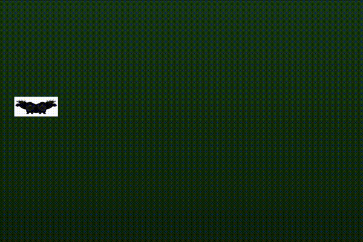

To be used on a tv or projector.
Elk range model:
- 80m distance
- 23m track
- Figure is moving at 5.3m/s (23m in 4.3 sec)
- Figure is 3m wide (double figure) and 117cm heigh.
- Figure pauses for two seconds on each side of the track before moving back.
- 
To adjust the speed and dimensions to be realistic you need to add the following settings:
- Distance to screen
- Screen horizontal resolution
- Screen pixel density

Caveat:
- Scopes with high zoom can't cope with short distance to screen. The image becomes too blurry.

